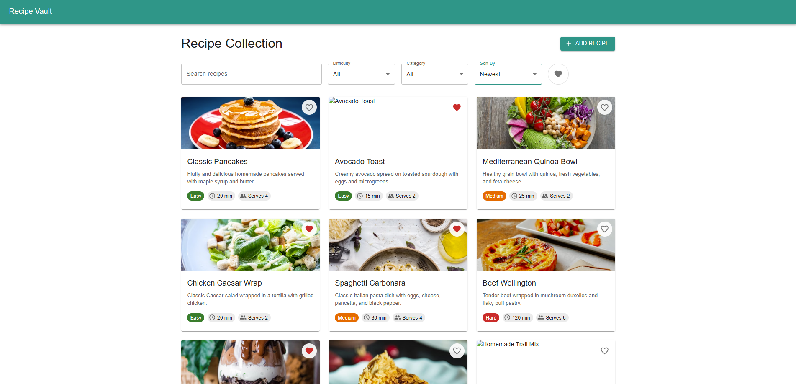
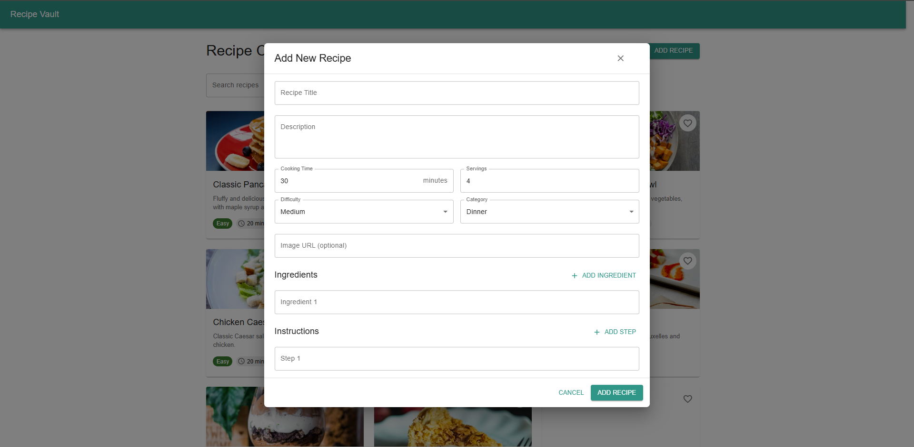
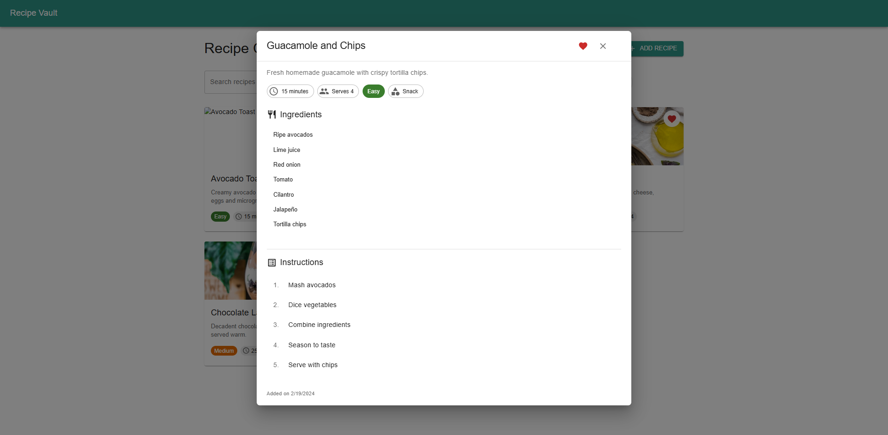

# 🍳 Recipe Vault

A modern, responsive recipe management application built with React and TypeScript.





## ✨ Features

### 📱 Responsive Design
- Mobile-first approach
- Seamless experience across all devices
- Beautiful Material-UI components

### 🔍 Advanced Search & Filtering
- Search by title and description
- Filter by:
  - Difficulty level (Easy, Medium, Hard)
  - Category (Breakfast, Lunch, Dinner, Dessert, Snack)
  - Cooking time
  - Favorites
- Multiple sorting options:
  - Name
  - Cooking time
  - Difficulty
  - Date added


### 📖 Recipe Management
- Add new recipes with comprehensive details
- Mark favorites for quick access
- Detailed view with ingredients and instructions
- Dynamic form validation


### 💫 Interactive UI
- Beautiful recipe cards
- Detailed modal views
- Favorite toggle functionality
- Real-time filtering and sorting


## 🛠 Technical Stack

- **Frontend Framework**: React 18
- **Language**: TypeScript
- **Build Tool**: Vite
- **UI Library**: Material-UI (MUI)
- **State Management**: React Hooks
- **Styling**: Emotion

## 📦 Dependencies

```json
{
  "@emotion/react": "^11.0.0",
  "@emotion/styled": "^11.0.0",
  "@mui/material": "^5.0.0",
  "@mui/icons-material": "^5.0.0",
  "react": "^18.0.0",
  "react-dom": "^18.0.0"
}
```

## 🚀 Getting Started

1. Clone the repository:
```bash
git clone https://github.com/yourusername/recipe-vault.git
```

2. Install dependencies:
```bash
cd recipe-vault
npm install
```

3. Start the development server:
```bash
npm run dev
```

4. Open [http://localhost:5173](http://localhost:5173) in your browser

## 📱 Screenshots

### Home Screen


### Recipe Grid


### Recipe Details


### Add Recipe Form


## 🎯 Future Improvements

- [ ] Backend integration with database
- [ ] User authentication
- [ ] Recipe sharing functionality
- [ ] User profiles
- [ ] Recipe editing and deletion
- [ ] Advanced filtering options
- [ ] Mobile app version

## 🤝 Contributing

Contributions are welcome! Please feel free to submit a Pull Request.

## 📝 License

This project is licensed under the MIT License - see the [LICENSE](LICENSE) file for details.

## 👏 Acknowledgments

- Recipe images from [Unsplash](https://unsplash.com)
- Icons from [Material Icons](https://mui.com/material-ui/material-icons/)
- UI Components from [Material-UI](https://mui.com)

## 📞 Contact

- GitHub: [@yourusername](https://github.com/yourusername)
- Email: your.email@example.com

---
Made with ❤️ using React and TypeScript
